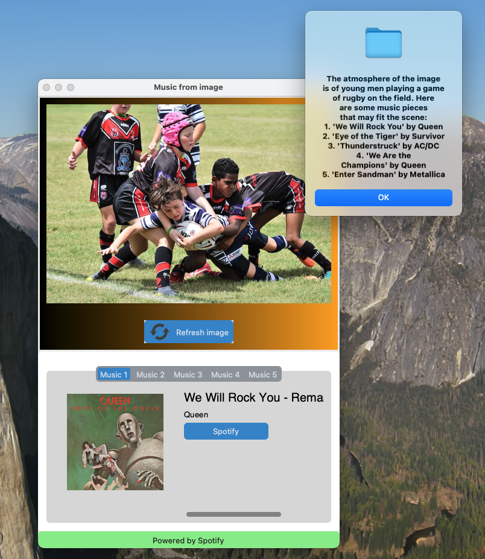

# Rutilea 選考課題2

## About
A laptop application to suggest music based on the atmosphere of given image. This is an assignment project for Rutilea selection.

### Non-AI-native application engineering, Task 3
> Developing an application that uses LLM to select music appropriate to the atmosphere of a given photograph. ([Google docs](https://docs.google.com/document/d/1BQRDnBziHUUKzwzlD68ZyD3Bq0XrTHt2dYSwgHeLGP8/edit))



## Usage
### Setup
Entire application is implemented by Python. Before activation, create an environment with `environment.yml`.
```bash
conda env create -f environment.yml
```

### API keys
Application uses following API keys to function. Please prepare them in advance.
- OpenAI API key : for using GPT-3.5 as LLM in `src/visual_LLM.py`.
- Spotify Client ID & Secret : for using Spotify API in `src/spotify.py`.

### Activation
Run following command in your terminal. Program should be ran in the top directory (`Rutilea`).
```bash
python gui.py
```

## Files & Directories
- `gui.py` : Toplevel of application.
- `src` : Functions for back-processing.
    + `spotify.py` : For Spotify search.
    + `visual_LLM.py` : GPT-3.5 agent for suggesting musical piece from image.
    + `image_tools.py` : Image description tools for GPT agent.
- `img` : Directory for storing image files. **DO NOT delete files except `img/artwork_*.jpg`**.
- `environment.yml` : Requirements for conda environment.
- `experiments` : Experiment projects used for development.

## Reference
- ["Ask questions to your images using LangChain and Python"](https://nayakpplaban.medium.com/ask-questions-to-your-images-using-langchain-and-python-1aeb30f38751), a Medium blog by Plaban Nayak